# ICT 기획운영부 개인과제

## 인턴 234112 김성범

- 목표: 금융 보안 정책 기반 클라우드 아키텍처 설계 및 서비스 제공 환경 구현
- 과제:
    
    **1) NHN 클라우드 환경에 k8s 클러스터를 구성하고, CI/CD 파이프라인을 통해
    컨테이너 배포 가능한 환경 구축 (필수) → 완료**
    
    - **오픈소스 툴(Git, Jenkins, Harbor, ArgoCD 등)을 이용한 자동화 배포 구성(선택) → 완료**
    - **간단한 어플리케이션 컨테이너 기동 (ex. Nginx, jeus, DB 등) (선택) → 완료**
    
    **2) 모니터링 환경 및 모니터링 대시보드 구성을 통한 시각화 (필수) → 완료**
    
    - **모니터링 알람 설정 (ex. Slack 등) (선택) → 완료**
    
    3) 금융권 보안정책에 적합한 아키텍처 설계 (필수)
    
    - 망분리, 침입 차단을 위한 보안 설정 (ex. VPC분리, SG 설정 등) (필수)
    - 계정권한분리등(선택)

## 개인 목표

1. **클라우드 환경을 이용한 빠른 인프라 구축**
    - NHN 클라우드 상에서 VPC, 서브넷, Kubernetes 클러스터 등을 구성하고 관리하는 것.
2. **CI/CD 파이프라인 구축**
    - CICD 도구인 ArgoCD 및 젠킨스를 활용하여 CI/CD 파이프라인을 구축하는 것.
    - 클러스터에 배포를 자동화하고 효율적으로 관리하기 위해 젠킨스와 같은 도구를 클러스터에 연결하고 설정하는 과정 경험.
3. **클러스터 관리 및 테스트**
    - Kubernetes 클러스터의 관리와 테스트를 통해 클러스터의 안정성과 기능을 확인.
    - Ingress를 활용하여 Nginx 테스트 서버를 배포하고 로드 밸런서를 통해 작동 여부를 확인하는 것.
4. **보안 및 인증 설정**
    - 시크릿 파일을 통해 클러스터 정보를 안전하게 관리하고 이를 통해 클러스터에 접근하여 배포하는 것.
5. **모니터링 환경 및 모니터링 대시보드 구성**
    - 실시간으로 시스템 및 애플리케이션을 모니터링하고
    - 로그, 메트릭 및 경고 시스템을 구축하여 시스템의 상태를 신속하게 파악할 수 있는 환경구성.

## 전체 요약

1. **환경 설정**
    - NHN 클라우드에서 VPC 및 서브넷을 생성하고, 처음에는 Kubernetes 클러스터를 프라이빗 서브넷에 배치했습니다.
2. **CICD 시도 및 문제 발생**
    - CICD를 위해 ArgoCD를 사용하여 먼저 테스트를 진행했으나, 프라이빗 서브넷에 둔 Kubernetes 클러스터로는 Repo 연결에 실패했습니다.
    - 퍼블릭 서브넷으로 Kubernetes 클러스터를 배치시켰습니다.
3. **클러스터 테스트**
    - 마스터 노드로 진입하여 Ingress를 활용하여 Nginx 테스트 서버를 올렸다. 이를 통해 로드 밸런서를 사용하여 경로 /test에서 Nginx가 올바르게 작동하는지 확인했다.
4. **젠킨스 및 CICD 구축**
    - 젠킨스를 위한 네임스페이스를 만들고, 이를 통해 CICD를 시도하려 했습니다.
    - 처음에는 Git 레포지토리에 있는 젠킨스 파일에서 시크릿 텍스트로 클러스터 정보를 가져오려고 했으나 실패했다.
    - 이후 시크릿 파일로 클러스터 정보를 가져왔지만, 여전히 문제가 있었습니다. 에러는 시크릿 파일 관련 문제였습니다.
    - 관련 블로그를 참고하여 시크릿 파일의 양식을 수정하고 이후에는 잘 작동했습니다. 이를 통해 클러스터에 배포를 할 수 있었습니다..
5. **모니터링 환경 구축**
    - 프로메테우스를 이용해 데이터를 수집하고 그라파나를 이용해 데이터를 시각화 하였습니다.
    - 슬랙을 이용해 모니터링 알람 환경을 구축했습니다.

# 전체 진행 과정

## **초기 아키텍처**

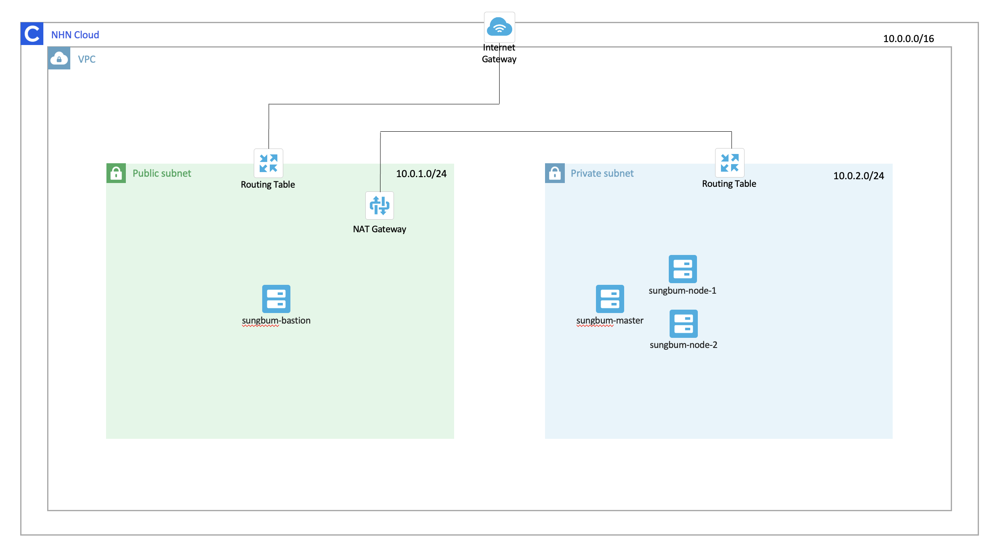

- VPC를 생성하고 Public Subnet, Private Subnet을 만들어 망분리를 하였습니다.
- Public Subnet의 Routing table과 Internet gateway를 연결하고, Private Subnet의 Routing table과 NAT Gateway를 연결해 네트워크를 구성하였습니다.
- Public Subnet에 Bastion 서버를 두고, Private Subnet에 쿠버네티스 클러스터를 위한 master 인스턴스 한개와 , worker 인스턴스 두개를 생성하였습니다.

### 쿠버네티스 클러스터 구축시도

먼저 CentOs로 생성된 인스턴스에서 클러스터 구축을 시도했습니다.

- **Swap메모리 비활성화**
    - 컨테이너가 메모리 부족 상태에 있을 때 Kubernetes는 해당 노드에 새로운 Pod를 스케줄링할 수 있지만, Swap이 활성화되어 있다면 메모리 상태를 정확히 예측하기 어려워 예상치 못한 문제가 발생할 수 있다고 하여 **Swap메모리를 비활성화**처리하였습니다.
- 도커, 쿠버네티스 설치
    - `sudo kubeadm init --pod-network-cidr=10.244.0.0/16 --apiserver-advertise-address={마스터노드 IP}`을 통해 마스터노드의 config를 구성하였습니다.
    - worker 노드에서 토큰을 이용해 `sudo kubeadm join`하여 쿠버네티스 클러스터를 구성하였습니다.

이후 클러스터에 nginx를 Deploy시도 하던 중 실수로 `kubeadm init`을 하여 클러스터를 초기화 해버린 문제가 발생했습니다. 

`sudo kubeadm reset`을 통해 노드를 초기화 하고 다시 클러스터 구축을 시도하였으나

```java
*The connection to the server localhost:8080 was refused - did you specify the right host or port*
```

에러가 발생하였습니다.

“**원인: 마스터노드에서의 kubectl 관련 config가 설정이 되지 않았기 때문”** 이라고 생각되어 실제로 master 노드에서의 config를 확인해본 결과

```java
$ kubectl config view
apiVersion: v1
clusters: []
contexts: []
current-context: ""
kind: Config
preferences: {}
users: []
```

config 구성이 되어있지 않음을 확인할 수 있었습니다. 문제를 해결하기 위해 다음의 명령어 및

```bash
mkdir -p $HOME/.kube
sudo cp -i /etc/kubernetes/kubelet.conf $HOME/.kube/config
sudo chown $(id -u):$(id -g) $HOME/.kube/config
```

인스턴스 삭제후 재 생성 등의 시도를 하였으나 결국 해결하지 못해 Ubuntu를 이용해 클러스터를 구성하였습니다.

### CI/CD 환경 구축 시도

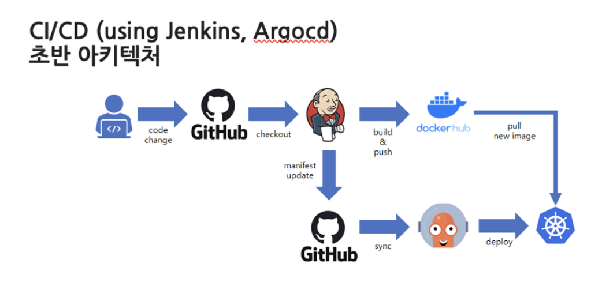

- CD를 위해 ArgoCD를 사용하여 테스트를 진행하였습니다.
- Github에 deploy.yaml 파일을 다음과 같이 구성하고 ArgoCD가 해당 레포지토리를 바라보게 시도하였습니다.
    
    ```java
    apiVersion: apps/v1
    kind: Deployment
    metadata:
     name: test
     namespace: demo
    spec:
     replicas: 2
     selector:
       matchLabels:
         app: test
     template:
       metadata:
         labels:
           app: test
       spec:
         containers:
         - name: test
           image: nginx
           ports:
           - containerPort: 80
    ---
    apiVersion: v1
    kind: Service
    metadata:
     name: test
     namespace: demo
    spec:
     ports:
       - name: test-port
         port: 80
         targetPort: 80
     selector:
       app: test
     type: NodePort
    ```
    
- Kubernetes를 Private Subnet에 둔 탓인지 time out 문제가 발생해 Repository 연결에 실패했습니다.
    
    ```
    DeletionError
    dial tcp 10.105.201.92:6379: i/o timeout
    Unable to load data: dial tcp 10.105.201.92:6379: i/o timeout
    Unable to delete application resources: dial tcp 10.105.201.92:6379: i/o timeout
    ```
    

## 새로운 아키텍처

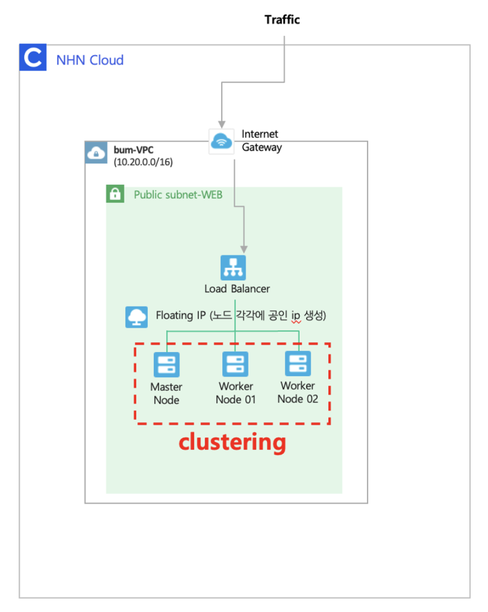

- VPC를 생성하고 Public Subnet에 Internet gateway를 연결하였습니다.
- Public Subnet에 쿠버네티스 클러스터를 위한 master 인스턴스 한개와 , worker 인스턴스 두개를 생성하였습니다.
- 앞서 진행한 방법대로 쿠버네티스 클러스터를 구축하였습니다.
- Ingress를 활용하여 Nginx 테스트 서버를 demo 네임스페이스에 배포했습니다. 로드 밸런서를 사용하여 /test 경로로 Nginx가 제대로 동작하는지 확인했습니다.
    - **[http://133.186.132.236/test](http://133.186.132.236/test) → 에 접속하여 확인 가능합니다.**
    
    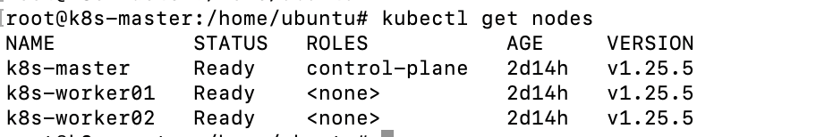
    
    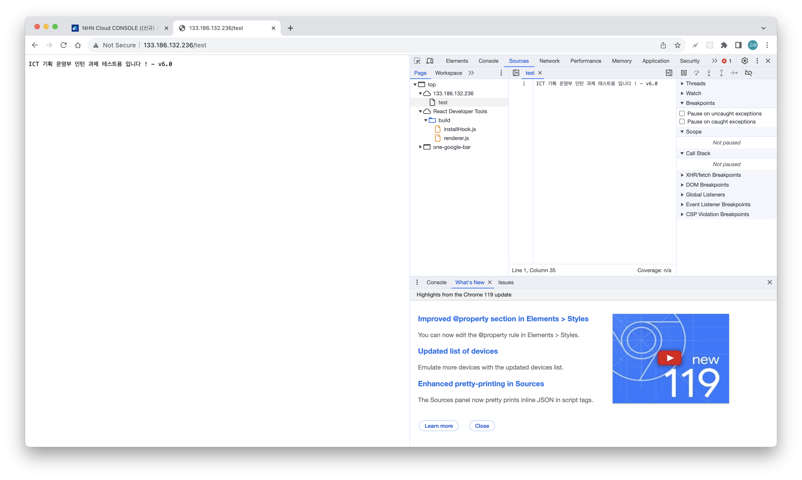
    

왜 인그레스를 썼냐?
서비스 확장성때문이다. 메타가 msa 기반으로 클라우드 네이티브로 돌리는건데 서비스가 계속 늘어나면 그거에 따른 간단한 인그레스 설정으로 서비스를 빠르게 붙일 수있다. 그래서 인그레스 썼다.

### CI/CD 환경 구축 시도

- Private Subnet을 사용해서 시도했던 방식과 동일하게 ArgoCD를 이용해 CD를 구현하려고 시도하였습니다.
- Public Subnet에 두면 ArgoCD가 깃 레포지토리를 바라볼 수 있을 줄 알았으나 Private Subnet에서 진행할때 발생했던 오류와 동일하게 `i/o timeout` 에러가 발생하였습니다.
- 그래서 차선으로 Jenkins를 이용해 CI/CD를 모두 구축하는 방식으로 아키텍처를 설계하였습니다.

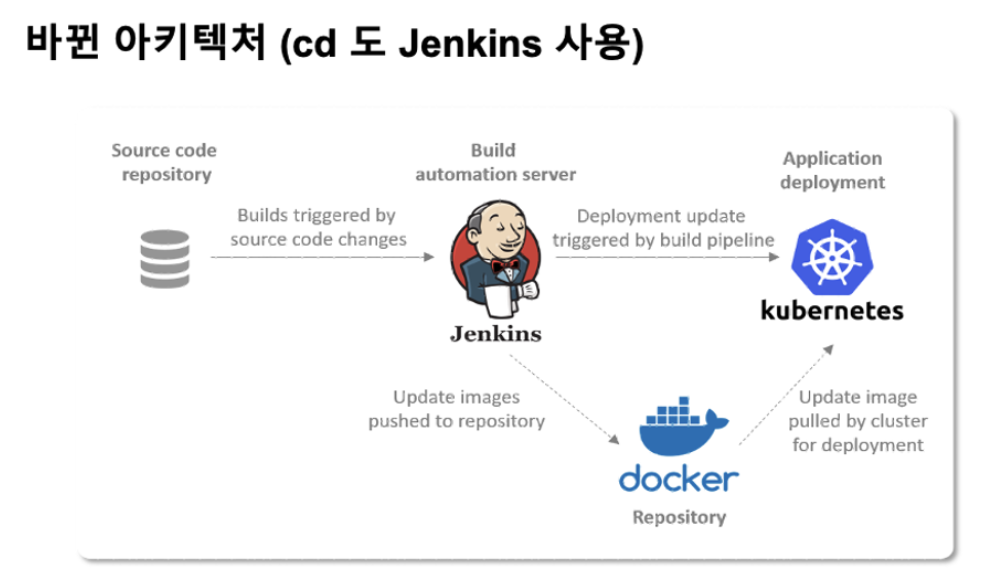

- 젠킨스를 위한 네임스페이스를 만들고, CI/CD를 시도했습니다.
- 젠킨스는 클러스터에 대한 정보를 필요로 합니다. 따라서 젠킨스 파일(Git 레포지토리)에서 kubeconfig를 통해 클러스터 정보를 가져와야 했습니다.
- 초기에 시크릿 텍스트로 가져오려고 했으나 실패하여 시크릿 파일로 변경하여 시도했고, 클러스터에 배포할 수 있게 되었습니다.

젠킨스 서버 : [http://133.186.132.236:8080](http://133.186.132.236:8080/job/demo/)
    
    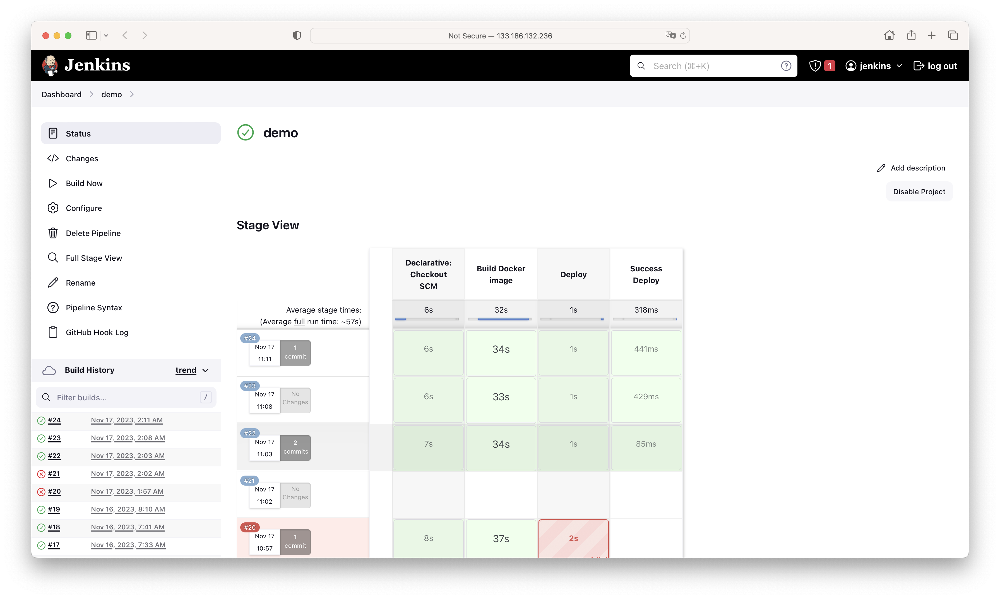
    
- webhook 설정으로 내 레포지토리의 변경이 생기면 자동 빌드되게 하였습니다.
    - 웹훅은 깃허브 레포지토리에 변화가 발생한다면 깃허브에서 젠킨스로 이벤트가 생겼다고 알림을 보냅니다.
- git repo에 있는 Dockerfile을 읽어 바뀐 코드로 도커 이미지 생성합니다.
- 돌아가고 있는 서버의 이미지 업데이트 → 새로운 도커 이미지로 배포 되는 것을 확인 할 수 있습니다.

## 모니터링 구현

## Prometheus →Monitoring

현재 그라파나 서비스

[http://125.6.38.228/d/k8s_views_nodes/kubernetes-views-nodes?orgId=1&refresh=30s&var-job=node-exporter&var-datasource=a3ffb3ab-eba7-4473-994d-227995b9ceab&var-resolution=30s&var-node=k8s-master&var-instance=](http://125.6.38.228/d/k8s_views_nodes/kubernetes-views-nodes?orgId=1&refresh=30s&var-job=node-exporter&var-datasource=a3ffb3ab-eba7-4473-994d-227995b9ceab&var-resolution=30s&var-node=k8s-master&var-instance=)

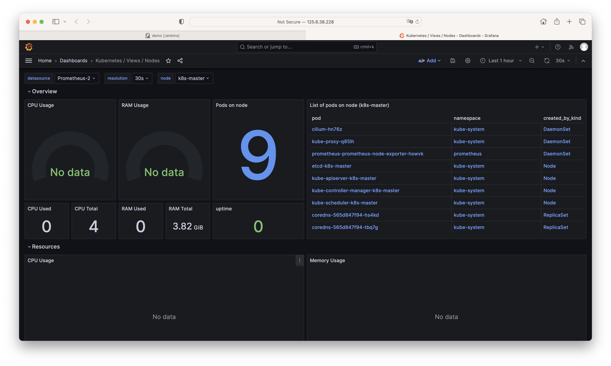

→ 결과: kube-system 에 돌아가고 있는 파드들을 확인 할 수 있습니다.

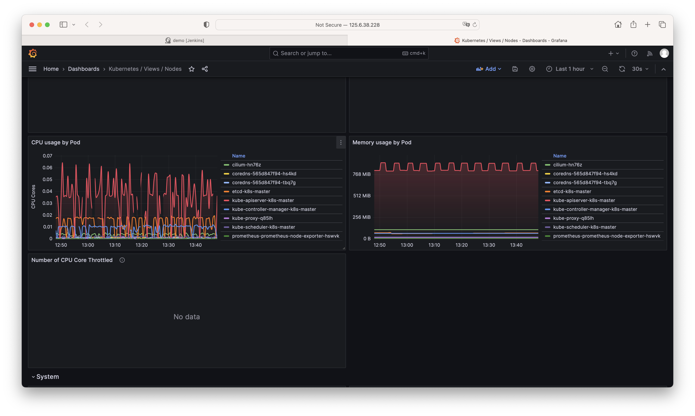

→ 파드의 cpu 사용량을 확인할 수 있습니다.

### Jmeter를 이용한 부하테스트

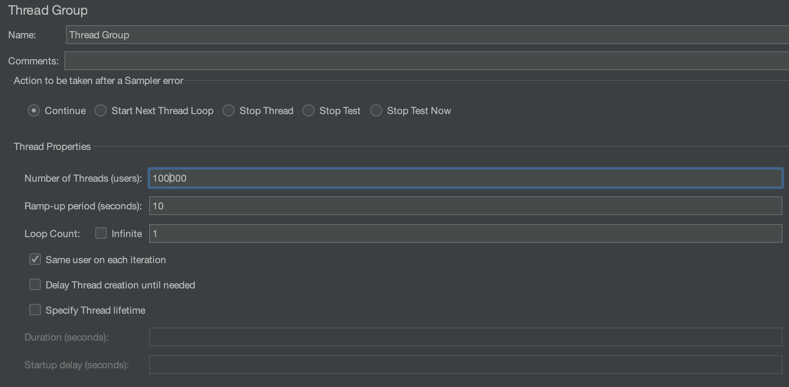

- Apatche Jmeter를 사용해서 테스트 시나리오를 작성하고 부하를 주면 pod가 늘어나고 줄어드는 것을 직접 확인해 보기 위해 시도했습니다.
- 이를 위한 auto-scaling 설정을 위해 metric-server를 한번 수정했습니다.
- 그 이후로 메트릭 서버가 문제가 생겨 복구가 안되어 현재는 메트릭 수집할 수 있는 것이 한정적으로 보이는 상태입니다. → No data 라고 보이는 부분

## 모니터링 알람 설정

- 슬랙에 Jenkins CI 통합 앱을 추가 빌드 및 배포가 이루어졌을 때 슬랙을 통해 알람이 오도록 구성하였습니다.

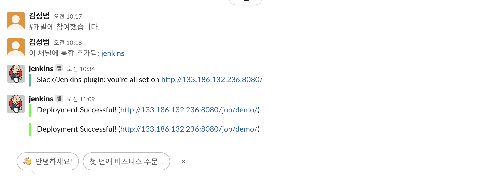

### 현재 cluster에서 돌아가고 있는 pod들

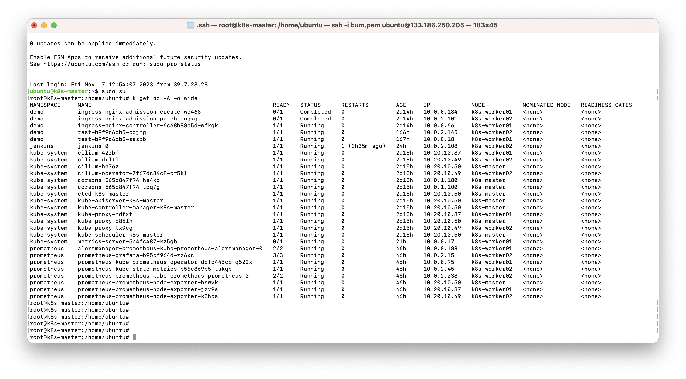

### 과제 후기

1. **실전 경험의 중요성 이해:**  과제를 진행하면서, 실제로 클라우드 환경을 구축하고 운영하는 데 필요한 기술과 프로세스에 대해 심층적으로 이해할 필요성을 느낄 수 있었습니다. 실전 경험이 이론적인 지식을 보다 실용적으로 활용하고 문제 해결 능력을 키우는 데 얼마나 중요한지를 깨달았습니다.
2. **문제 해결 및 대응 능력 향상:** 과제 진행 중 발생한 여러 가지 문제들을 해결하는 과정에서, 문제를 분석하고 해결하는 능력이 향상되었습니다. Kubernetes 클러스터 구축 및 연결 문제, CI/CD 파이프라인 설정에서의 오류 등 다양한 상황에서 문제를 해결하는 데 필요한 능력을 키울 수 있었습니다.
3. **커뮤니케이션과 협업의 중요성:** 프로젝트를 진행하면서 팀원들과의 협업과 소통이 얼마나 중요한지를 깨달았습니다. 서로의 아이디어를 공유하고, 문제를 해결하기 위해 함께 노력하며 서로의 역량을 보완하는 것이 프로젝트의 성공에 매우 중요하다는 것을 깨달았습니다.
4. **보안과 안정성에 대한 인식:** 금융 보안 정책과 보안적 요구사항을 고려하여 아키텍처를 설계하고 구현하는 과정에서, 보안적 측면에서의 중요성과 안정성에 대한 인식을 높일 수 있었습니다.
5. **지속적인 학습과 개선:** 스스로 부족한점들을 많이 깨닫고, 새로운 기술과 도구에 대한 지식을 습득하고, 지속적인 학습과 개선의 필요성을 깨달을 수 있었습니다. 클라우드 환경, 모니터링 도구, 보안 정책 등에 대한 학습을 지속하고, 더 나은 방법과 접근 방식을 탐구하는 것이 중요하다는 것을 알 수 있었습니다.

참고자료

[https://kubernetes.io/docs/home/](https://kubernetes.io/docs/home/)

[https://seongjin.me/kubernetes-cluster-components/](https://seongjin.me/kubernetes-cluster-components/)

[https://blog.bespinglobal.com/post/k8s-개념-및-cluster-구축-실습/](https://blog.bespinglobal.com/post/k8s-%EA%B0%9C%EB%85%90-%EB%B0%8F-cluster-%EA%B5%AC%EC%B6%95-%EC%8B%A4%EC%8A%B5/)

[https://velog.io/@chan9708/k8ssettings](https://velog.io/@chan9708/k8ssettings)

[https://medium.com/finda-tech/overview-8d169b2a54ff](https://medium.com/finda-tech/overview-8d169b2a54ff)

[https://seongwon.dev/DevOps/20220715-CICD구축기1/](https://seongwon.dev/DevOps/20220715-CICD%EA%B5%AC%EC%B6%95%EA%B8%B01/)

[https://velog.io/@hmyanghm/AWS-EC2에-Jenkins-서버-구축#---프리티어-ec2-스왑-파티션-생성](https://velog.io/@hmyanghm/AWS-EC2%EC%97%90-Jenkins-%EC%84%9C%EB%B2%84-%EA%B5%AC%EC%B6%95#---%ED%94%84%EB%A6%AC%ED%8B%B0%EC%96%B4-ec2-%EC%8A%A4%EC%99%91-%ED%8C%8C%ED%8B%B0%EC%85%98-%EC%83%9D%EC%84%B1)

[https://guide.ncloud-docs.com/docs/devtools-devtools-1-2](https://guide.ncloud-docs.com/docs/devtools-devtools-1-2)

[https://www.theteams.kr/teams/6045/post/69805](https://www.theteams.kr/teams/6045/post/69805)

[https://nayoungs.tistory.com/entry/Kubernetes-Kubeconfig](https://nayoungs.tistory.com/entry/Kubernetes-Kubeconfig)

[https://postlude.github.io/2021/07/03/kops-k8s-deploy-nginx/](https://postlude.github.io/2021/07/03/kops-k8s-deploy-nginx/)

[https://seongjin.me/kubernetes-service-types/](https://seongjin.me/kubernetes-service-types/)

[https://gksdudrb922.tistory.com/237](https://gksdudrb922.tistory.com/237)